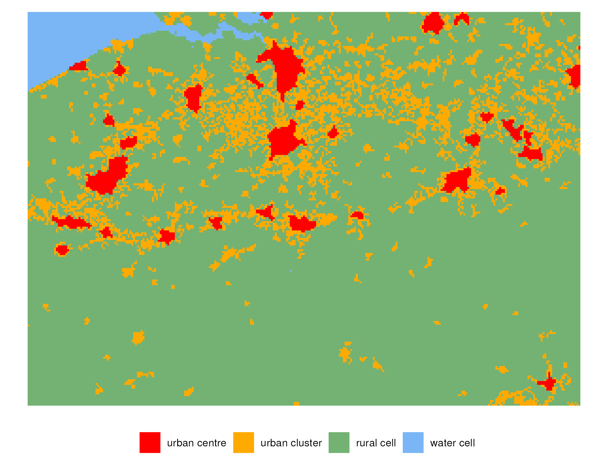
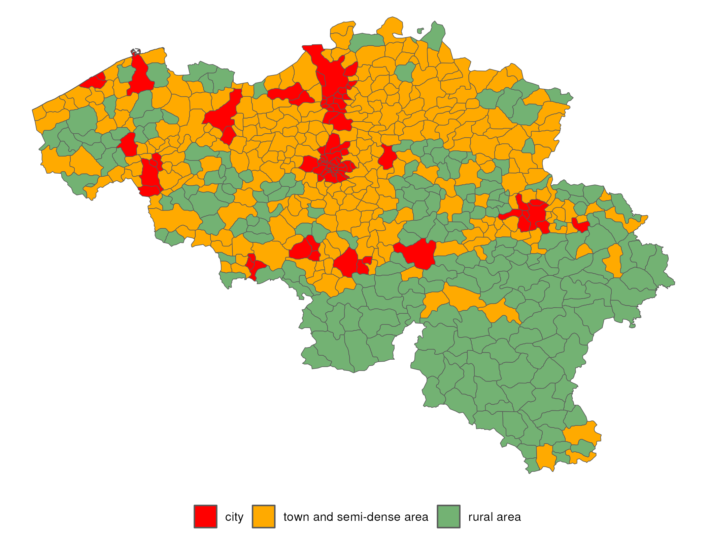

<!-- README.md is generated from README.Rmd. Please edit that file -->

```{r, include = FALSE}
knitr::opts_chunk$set(
  collapse = TRUE,
  comment = "#>",
  fig.path = "man/figures/README-",
  out.width = "100%"
)
```

# Flexurba
**An open-source R package to flexibly reconstruct the Degree of Urbanisation classification**

<!-- badges: start -->

<!-- badges: end -->

The Degree of Urbanisation (DEGURBA) is an operational definition of cities, towns and rural areas that is widely used in policy reports and academic circles. It is developed by six international organisations - among which the European Commission and the OECD - to provide a globally consistent delineation of urban areas and thus enhance statistical comparability across nations. Much effort has been devoted to making the workflow behind the methodology as transparent and reproducible as possible: it is extensively documented in a manual ([Eurostat, 2021](https://ec.europa.eu/eurostat/statistics-explained/index.php?title=Applying_the_degree_of_urbanisation_manual)) and a set of analytical tools is provided by the Global Human Settlement Layer ([GHSL, 2023](https://ghsl.jrc.ec.europa.eu/tools.php)) to reproduce the classification. The current suite of tools uses a graphical user interface. This certainly enhances the ease of use, but also obscures the underlying code and restricts the user from adapting implementation details in the algorithm. Consequently, it complicates extending or amending the methodology to facilitate other, related uses. Furthermore, it inhibits research drawing on DEGURBA beyond its direct application, such as sensitivity analyses and/or comparative research.

Against this backdrop, we developed the `flexurba` package: a **flex**ible reconstruction of the DEG**URBA** algorithm. The package encompasses the first open implementation of DEGURBA's algorithm in any programming language. It provides flexibility to the user to customise the parameters in the algorithm and evaluate the consequences of certain implementation choices. The user can construct alternative versions of DEGURBA by changing the minimum population thresholds, and even more 'hidden' implementation details, such as the contiguity requirements and edge smoothing rules.

For an extensive description of the package and its contribution: see \<*the paper is currently still under review, the link to the paper will be added here if published\>*. 

For the source code of the package: see [the GitLab repository](https://gitlab.kuleuven.be/spatial-networks-lab/research-projects/flexurba). The documentation of all functions can be found [on this website](https://flexurba-spatial-networks-lab-research-projects--e74426d1c66ecc.pages.gitlab.kuleuven.be/).

## Degree of Urbanisation

The DEGURBA methodology consists of two consecutive stages: (1) a grid cell classification and (2) a spatial units classification. In the first stage, the cells of a 1 km² population grid are classified into three different categories based on the following rules, detailed in the [GHSL Data Package 2023](https://ghsl.jrc.ec.europa.eu/documents/GHSL_Data_Package_2023.pdf):

-   **Urban Centres** are clusters of cells (rooks continuity) with a minimum population density of 1500 inhabitants per km² of permanent land or a minimum 'optimal' built-up area threshold. In addition, the total population in these clusters should be at least 50 000. Gaps in the urban centres are filled and edges are smoothed.
-   **Urban Clusters** are clusters of cells (queens continuity) with a minimum population density of 300 inhabitants per km² of permanent land and a minimum total population of 5000 inhabitants. Cells that belong to urban centres are removed from urban clusters.
-   **Rural grid cells** do not belong to an urban centre or cluster.

In the second stage, small administrative or statistical spatial units are classified into (1) cities, (2) towns and semi-dense areas, (3) and rural areas based on the proportion of population in the three grid classes:

-   **Cities**: local units that have at least 50% of their population in urban centres.
-   **Towns and semi-dense areas**: local units that have less than 50% of their population in an urban centre and no more than 50% of their population in rural grid cells.
-   **Rural areas**: local units that have more than 50% of their population in rural grid cells.

For more information about the methodology, readers can consult [Dijkstra et al. 2021](https://www.sciencedirect.com/science/article/pii/S0094119020300838), [Eurostat 2021](https://ec.europa.eu/eurostat/statistics-explained/index.php?title=Applying_the_degree_of_urbanisation_manual) and [Global Human Settlement Layer website](https://ghsl.jrc.ec.europa.eu/degurba.php) (GHSL).

## Installation

The `flexurba` package can be installed as follows:

``` r
install.packages("remotes")
remotes::install_gitlab("spatial-networks-lab/research-projects/flexurba", host="https://gitlab.kuleuven.be/", upgrade = "always")
```

*Important notes for installation:*

-   The `flexurba` package uses `C++` code for certain functions. Please make sure to have [MAKE](https://gnuwin32.sourceforge.net/packages/make.htm) installed on your computer.

-   While installing the package, R will give a prompt to install [Rtools](https://cran.r-project.org/bin/windows/Rtools/) (if not already installed). Please click "YES" and make sure you have appropriate administrator rights for this.

## Example

Below is a basic example which shows how to use the package to (1) download the required data from the GHSL website, (2) construct the grid cell classification and (3) construct the spatial units classification.

### (1) Download data products from the GHSL website

The grid classification of the Degree of Urbanisation requires three data sources: a population grid, built-up area grid and land grid. The code below demonstrates how the `flexurba` functions can be used to download the required data. Alternatively, the required data can be download from the [GHSL website](https://ghsl.jrc.ec.europa.eu/) directly.

```{r example1a, eval = FALSE}
library(flexurba)

# create a directory to save the data:
dir.create("data")

# make sure the time out is large enough to download all the data
options(timeout = 500)

# download the GHSL data on a global scale and save it in
# the directory "data/global"
download_GHSLdata(output_directory = "data/global")

# crop the global grid to a custom extent (here: Belgium) and save it
# in the directory "data/belgium"
# the coordinates of the extent should be provided in the Mollweide projection
crop_GHSLdata(
  extent = terra::ext(192000, 485000, 5821000, 6030000),
  global_directory = "data/global",
  output_directory = "data/belgium"
)
```

When employing the code above, the three data sources will be saved in the output directory as `POP.tif`, `BUILT.tif` and `LAND.tif` respectively.

## (2) Grid cell classification (stage 1)

Now that we have the data, we can construct the grid cell classification as follows.

```{r example1b, eval = FALSE}
# preprocess the data
data_belgium <- preprocess_grid("data/belgium")

# run the algorithm with the standard parameter settings
classification1 <- classify_grid(data = data_belgium)

# plot the resulting grid
plot_grid(classification1)
```

{width="450"}

However, the `flexurba` package has more functionalities. The function `classify_grid()` allows the user to adapt various parameters in the classification algorithm, including the the minimum population thresholds or the smoothing rules.

The code below adapts the following parameter settings:

-   `UC_density_threshold = 1250`: the minimum density threshold for urban centres (`UC`) is changed to 1250 inhabitants per km² instead of the standard value of 1500 inhabitants per km².

-   `UC_size_threshold = 60000`: the minimum size threshold for urban centres (`UC`) is increased from 50 000 inhabitants to 60 000 inhabitants.

-   `UC_gap_fill = FALSE` and `UC_smooth_edge = FALSE`: urban centres are created without filling gaps and smoothing the edges.

```{r example1c, eval = FALSE}
# run the algorithm with custom parameter settings
classification2 <- classify_grid(
  data = data_belgium,
  parameters = list(
    UC_density_threshold = 1250,
    UC_size_threshold = 60000,
    UC_gap_fill = FALSE,
    UC_smooth_edge = FALSE
  )
)

# plot the resulting grid
plot_grid(classification2)
```

{width="450"}

For more information about the possible parameters setting that can be adapted, readers can consult the section 'Custom specifications' in the documentation of `classify_grid()`.

## (3) Spatial units classification (stage 2)

Based on the grid classification, the spatial units classification can be constructed with the following code. The data object `flexurba::units_belgium` is used, containing the [GADM](https://gadm.org/) spatial units of Belgium (on municipal level).

```{r example2b, eval = FALSE}
# preprocess the data
data1 <- preprocess_units(
  units = flexurba::units_belgium,
  classification = classification1,
  pop = "data/belgium/POP.tif"
)

# run the algorithm for the units classification
units_classification <- classify_units(data1)

# visualise the results
plot_units(flexurba::units_belgium, classification = units_classification)
```

{width="500"}

*Please note that the classification functions are computationally quite heavy. Please use a small study area to start with. As a reference: the grid classification for the European continent takes approximately 187 seconds and requires around 10 GB RAM.*

## Vignettes

For more examples and an extensive description of the `flexurba` functions and their possible parameter settings, please consult the documentation pages of the individual functions. We also created some additional vignettes with more information and workflows of particular applications:

-   The `vignette("vig1-level2")` showcases how the grid cell and spatial units classification can be constructed according to Level 2 of the Degree of Urbanisation.
-   In the `vignette("vig2-multiple-configurations")`, we give an example on how to use the package to generate multiple alternative versions of the Degree of Urbanisation by systematically varying some parameters in the algorithm.
-   The `vignette("vig3-global-scale")` explains how a global classification can be established in a memory-efficient manner.
-   The GHSL released different versions of the Degree of Urbanisation in the past years. The `vignette("vig4-comparison-releases")` compares the method as described in [Data Packages 2022](https://ghsl.jrc.ec.europa.eu/documents/GHSL_Data_Package_2022.pdf) with the method as described in [Data Package 2023](https://ghsl.jrc.ec.europa.eu/documents/GHSL_Data_Package_2023.pdf).
-   The `vignette("vig5-computational-requirements")` elaborates on the computational requirements of the package and compares the computational load with the existing [GHSL tools](https://ghsl.jrc.ec.europa.eu/tools.php).
-   The `vignette("vig6-comparison-GHSL-SMOD")` compares the grid classification generated by `flexubra` with the official [GHSL SMOD layer](https://ghsl.jrc.ec.europa.eu/ghs_smod2023.php) and explains few discrepancies between the two classifications.

*Disclaimer: The `flexurba` package includes a reconstruction of DEGURBA's algorithm, and by no means contains an official implementation. For the official documents, readers can consult [Dijkstra et al. (2021)](https://www.sciencedirect.com/science/article/pii/S0094119020300838), [Eurostat (2021)](https://ec.europa.eu/eurostat/statistics-explained/index.php?title=Applying_the_degree_of_urbanisation_manual) and the [Global Human Settlement Layer website](https://ghsl.jrc.ec.europa.eu/degurba.php).*
