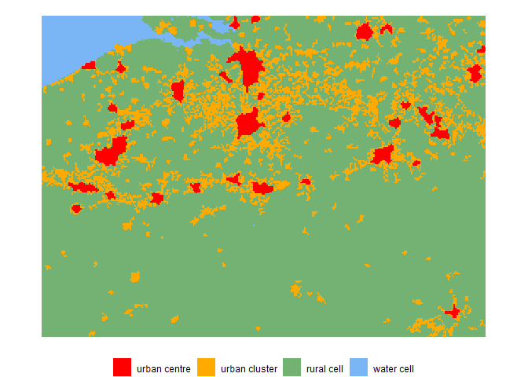

<!-- README.md is generated from README.Rmd. Please edit that file -->

# Flexurba

Flexurba is an open-source R package to construct **flex**ible **urba**n
delineations which can be tailored to specific applications or research
questions. The package was originally developed to flexibly reconstruct
the *Degree of Urbanisation*
([DEGURBA](https://human-settlement.emergency.copernicus.eu/degurba.php))
classification, but has since been expanded to support a broader range
of delineation approaches.

The source code of the package is available on [this GitLab
repository](https://gitlab.kuleuven.be/spatial-networks-lab/research-projects/flexurba)
and the documentation of all functions can be found [on this
website](https://flexurba-spatial-networks-lab-research-projects--e74426d1c66ecc.pages.gitlab.kuleuven.be/).

### Citation

To acknowledge the use of the package and for an extensive description
of its contribution, please refer to the following journal article:

*Van Migerode, C., Poorthuis, A., & Derudder, B. (2024). Flexurba: An
open-source R package to flexibly reconstruct the Degree of Urbanisation
classification. Environment and Planning B: Urban Analytics and City
Science, 51(7), 1706-1714. <https://doi.org/10.1177/23998083241262545>*

## Installation

The `flexurba` package can be installed as follows:

``` r
install.packages("remotes")
remotes::install_gitlab("spatial-networks-lab/research-projects/flexurba",
                        host="https://gitlab.kuleuven.be/", 
                        upgrade = "always")
```

*Important notes for installation:*

- The `flexurba` package uses `C++` code for certain functions. Please
  make sure to have
  [MAKE](https://gnuwin32.sourceforge.net/packages/make.htm) installed
  on your computer.

- While installing the package, R will give a prompt to install
  [Rtools](https://cran.r-project.org/bin/windows/Rtools/) (if not
  already installed). Please click `YES` and make sure you have
  appropriate administrator rights.

## Using flexurba

### 1. Reconstructing the DEGURBA grid classification

The DEGURBA methodology classifies the cells of a 1 km² population grid
into three different categories based on the following rules (detailed
in the [GHSL Data Package
2023](https://ghsl.jrc.ec.europa.eu/documents/GHSL_Data_Package_2023.pdf)):

- **Urban Centres** are clusters of cells (rooks continuity) with a
  minimum population density of 1500 inhabitants per km² of permanent
  land or a minimum ‘optimal’ built-up area threshold. In addition, the
  total population in these clusters should be at least 50 000. Gaps in
  the urban centres are filled and edges are smoothed.
- **Urban Clusters** are clusters of cells (queens continuity) with a
  minimum population density of 300 inhabitants per km² of permanent
  land and a minimum total population of 5000 inhabitants. Cells that
  belong to urban centres are removed from urban clusters.
- **Rural grid cells** do not belong to an urban centre or cluster.

We can reconstruct the standard grid cell classification for Belgium as
follows.

``` r
library(flexurba)

# load the example data for Belgium
data_belgium <- DoU_load_grid_data_belgium()

# run the DEGURBA algorithm with the standard parameter settings
classification1 <- DoU_classify_grid(data = data_belgium)

# plot the resulting grid
DoU_plot_grid(classification1)
```



The function `DoU_classify_grid()` also allows to adapt the standard
parameters in the DEGURBA algorithm. For example, the population
thresholds for urban centres can be adapted by changing the following
parameters:

- `UC_density_threshold = 1250`: the minimum density threshold for urban
  centres (`UC`) is changed to 1250 inhabitants per km² instead of the
  standard value of 1500 inhabitants per km².

- `UC_size_threshold = 60000`: the minimum size threshold for urban
  centres (`UC`) is increased from 50 000 inhabitants to 60 000
  inhabitants.

``` r
# run the algorithm with custom parameter settings
classification2 <- DoU_classify_grid(
  data = data_belgium,
  # here, we can specify custom population thresholds
  parameters = list(
    UC_density_threshold = 1250,
    UC_size_threshold = 60000
  )
)

# plot the resulting grid
DoU_plot_grid(classification2)
```


For more information about the possible parameters settings, see the
section ‘Custom specifications’ in the documentation of
`DoU_classify_grid()`.

### 2. Identifying urban areas by thresholding gridded datasets

Apart from DEGURBA, several other delineation approaches enforce
thresholds on gridded datasets. The accompanying
[`flexurbaData`](https://flexurbadata-ac82f4.pages.gitlab.kuleuven.be/index.html)
package provides preprocessed datasets that can serve as proxy to
identify urban areas. We can construct urban boundaries based on these
proxy datasets using the function `apply_threshold()`. The code examples
below enforce a predefined threshold on (1) built-up area and (2)
night-time light data.

``` r
# (1) predefined threshold of 15% built-up area

# load the example proxy data for Belgium
proxy_data_belgium <- load_proxies_belgium()

# apply the threshold
builtupclassification <- apply_threshold(proxy_data_belgium$built, 
                                         type="predefined",
                                         threshold_value = 0.15)

# plot the resulting urban boundaries
terra::plot(builtupclassification$rboundaries)
```


``` r
# (2) predefined threshold of 15 nW/cm³/sr

# apply the threshold
lightclassification <- apply_threshold(proxy_data_belgium$light, 
                                         type="predefined",
                                         threshold_value = 15)

# plot the resulting urban boundaries
terra::plot(lightclassification$rboundaries)
```


Besides a predefined threshold, the function `apply_threshold()` also
implements other types of thresholding approaches. For more information
on these, see `vignette("vig8-apply-thresholds")`.

## Vignettes

For more code examples, please consult the documentation pages of the
individual functions. We also created vignettes with more information
and workflows using `flexurba`.

- The `vignette("flexurba")` is a “Get Started” tutorial on using
  `flexurba` to reconstruct DEGURBA. It shows how to download the data
  from the GHSL website, construct a grid cell classification and a
  spatial units classification.
- The `vignette("vig1-DoU-level2")` showcases how the grid cell and
  spatial units classification can be constructed according to second
  hierarchical level of DEGURBA.
- The `vignette("vig2-DoU-multiple-configurations")` gives an overview
  on how to use the package to generate multiple alternative versions of
  DEGURBA by systematically varying parameters in the algorithm.
- The `vignette("vig3-DoU-global-scale")` explains how a global DEGURBA
  classification can be established in a memory-efficient manner.
- The GHSL released different versions of the *Degree of Urbanisation*
  in the past years. The `vignette("vig4-DoU-comparison-releases")`
  compares the method described in [Data Packages
  2022](https://ghsl.jrc.ec.europa.eu/documents/GHSL_Data_Package_2022.pdf)
  with the method described in [Data Package
  2023](https://ghsl.jrc.ec.europa.eu/documents/GHSL_Data_Package_2023.pdf).
- The `vignette("vig5-DoU-computational-requirements")` elaborates on
  the computational requirements of the package to reconstruct the
  DEGURBA classification, and compares the computational load with the
  existing [GHSL tools](https://ghsl.jrc.ec.europa.eu/tools.php).
- The `vignette("vig6-DoU-comparison-GHSL-SMOD")` compares the DEGURBA
  grid classification generated by `flexurba` with the official [GHSL
  SMOD layer](https://ghsl.jrc.ec.europa.eu/ghs_smod2023.php) and
  explains few discrepancies between the two classifications.
- The `vignette("vig7-DoU-population-grid")` illustrates how the DEGURBA
  functionalities can be used with other population grids
  (e.g. WorldPop).
- The `vignette("vig8-apply-thresholds")` elaborates on the benefits and
  limitations of different thresholding approach implemented by the
  function `apply_threshold()`.
- The `vignette("vig9-different-proxies")` illustrates how different
  proxy datasets can be used to identify urban areas using a combination
  of the data in the
  [`flexurbaData`](https://flexurbadata-ac82f4.pages.gitlab.kuleuven.be/index.html)
  package and the functions in the `flexurba` package.

*Disclaimer: The `flexurba` package includes a reconstruction of
DEGURBA’s algorithm, and by no means contains an official
implementation. For the official documents, readers can consult
[Dijkstra et
al. (2021)](https://www.sciencedirect.com/science/article/pii/S0094119020300838),
[Eurostat
(2021)](https://ec.europa.eu/eurostat/statistics-explained/index.php?title=Applying_the_degree_of_urbanisation_manual)
and the [Global Human Settlement Layer
website](https://ghsl.jrc.ec.europa.eu/degurba.php).*
