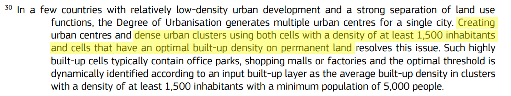

The [GHSL SMOD Layer](https://ghsl.jrc.ec.europa.eu/ghs_smod2023.php) represents the application of DEGURBA's Level 2 grid classification to the [population grid](https://ghsl.jrc.ec.europa.eu/ghs_pop2023.php) and the [built-up area grid](https://ghsl.jrc.ec.europa.eu/ghs_buS2023.php) provided by the [Global Human Settlement Layer](https://ghsl.jrc.ec.europa.eu/index.php).

In this vignette, we compare the grid classification generated by the `flexurba` package with this official GHSL SMOD Layer.

### Comparison with the GHSL SMOD Layer

Despite our attempts to reconstruct the DEGURBA algorithm precisely, there are some minor discrepancies between the grid classification generated by `flexurba` and the official GHSL SMOD Layer. The table below reports the difference on a global scale (in the number of 1 square km grid cells) between the Level 1 aggregation of the classes in the GHSL SMOD Layer on the one hand, and the classification generated by the following code on the other.

```{r eval=FALSE}
library(flexurba)

download_GHSLdata('regionsdata', extent="regions")

DoU_classify_grid(data = 'regionsdata', 
              filename = "regionsdata/result.tif",
              regions = TRUE)
```

*Table: Cross-tabular comparison of global zonal statistics (in the number of square km grid cells) between (1) the Level 1 aggregation of the classes in the GHSL SMOD Layer and (2) the results of the `flexurba` grid classification*.{alt="table comparison GHS-SMOD"}

Worldwide, there are 2951 cells classified differently. These represent a mere 0.002% of the global land area. Although the differences are relatively limited, the user should keep them in mind when employing the `flexurba` package.

## Potential sources of discrepancies

The discrepancies in the grid cell classification are likely caused by the three following issues.

*1. Difference in coding language*

First, differences in coding languages and versions of software libraries can lead to minor inconsistencies in the resulting classification. 

*2. Potential misinterpretation*

Second, there might be a misinterpretation of the official DEGURBA documentation from our end. This, in some way, highlights the importance of openly sharing exact source code alongside verbatim documentation. By publicly releasing the `flexurba` package, we hope to resolve discrepancies caused by misinterpretation with the input of the geospatial community and/or feedback of the developers of the official DEGURBA methodology. Please feel free to create an issue on the repository when you find a potential bug or inconsistency in the source code.

*3. Disparity between Level 1 and Level 2 documentation*

Third, there is a minor disparity between the Level 1 and Level 2 documentation of [GHSL Data Package 2023](https://publications.jrc.ec.europa.eu/repository/handle/JRC133256), which is likely at the root of some discrepancies in the table above. More specifically, the disparity lies between the Level 1 and Level 2 documentation of the class 'urban clusters'.

In Level 1 of DEGURBA, urban clusters are defined as contiguous grid cells (queen contiguity) with a density of at least 300 inhabitants per km² of permanent land and a total population of at least 5000 inhabitants. Cells belonging to urban centres are removed from urban clusters. In Level 2, urban clusters are subdivided into three sub-classes: (1) dense urban clusters, (2) semi-dense urban clusters and (3) suburban or peri-urban grid cells.

The disparity lies in the identification of "dense urban clusters". In [GHSL Data Package 2023](https://publications.jrc.ec.europa.eu/repository/handle/JRC133256), dense urban clusters are defined as contiguous cells (rooks contiguity) with a density of at least 1500 inhabitants per km² of permanent land and a total population of at least 5000, and less than 50000 inhabitants. According to this definition, every "dense urban cluster" (in Level 2) is part of an urban cluster (in Level 1). The two levels should thus indeed be nested.

However, when taking a closer look at the details in the [GHSL Data Package 2023](https://publications.jrc.ec.europa.eu/repository/handle/JRC133256), it appears that not only cells with at least 1500 inhabitants per km² are included in dense urban clusters, but also cells with a built-up density above the average "optimal" built-up density. This is mentioned in two distinct places in the [GHSL Data Package 2023](https://publications.jrc.ec.europa.eu/repository/handle/JRC133256).

-   In the explanation of the "optimal" built-up area rule in [footnote 30 on page 51](https://publications.jrc.ec.europa.eu/repository/handle/JRC133256):

{alt="GHS-SMOD footnote with notes"}

-   In the GHSL SMOD workflow figure [on page 53](https://publications.jrc.ec.europa.eu/repository/handle/JRC133256):

{alt="GHS-SMOD workflow with notes"}

Hence, cells with a built-up density above the "optimal" built-up density will be added to dense urban clusters (in Level 2), although these cells are not be included in urban clusters (in Level 1). This means that the two levels are actually not *completely* nested.

This minor disparity is in most cases negligible and has no influence when employing the GHSL SMOD Layer, because the GHSL does not produce a Level 1 grid classification. The GHSL SMOD Layer is only provided at Level 2, and according to the [website](https://ghsl.jrc.ec.europa.eu/ghs_smod2023.php#:~:text=First%20level%20can%20be%20obtained%20aggregating%20L2.), Level 1 should be obtained by aggregating the Level 2 classes.

However, because we implemented the Level 1 classification according to the definition of the Level 1 classes, and not by aggregating the Level 2 classes, this does have an influence when comparing the our result with the GHSL SMOD Layer. The cells that are added to dense urban clusters as a result of the (additional) built-up area rule will belong to 'urban clusters' in the Level 1 aggregation of the classes in the GHSL SMOD Layer. However, in the `flexurba` Level 1 classification, they will belong to 'rural cells'. These differently classified cells are also visible in the table above -- more specifically, 1812 cells could potentially be explained by this disparity.

We intentionally chose to implement the Level 1 classification according to the definition of the Level 1 classes, and not by the aggregation of Level 2 classes for two main reasons. First -- and most importantly --, in this way, our implementation is in line with the official methodology to identify Urban Clusters as described in the [DEGURBA methodological manual](https://ec.europa.eu/eurostat/statistics-explained/index.php?title=Applying_the_degree_of_urbanisation_manual_-_Methodology_for_applying_level_1_of_the_degree_of_urbanisation_classification#Urban_clusters_.28or_moderate-density_clusters.29). This definition is also used in the official paper regarding the Degree of Urbanisation (see [Dijkstra et al. 2021](https://www.sciencedirect.com/science/article/pii/S0094119020300838)). Second -- more practically --, constructing the Level 1 classification directly is computationally less expensive than constructing the Level 2 classification first, and aggregating it afterward.
