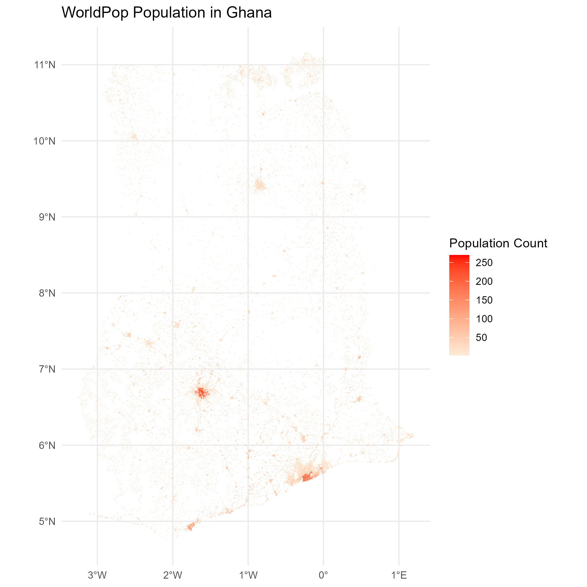
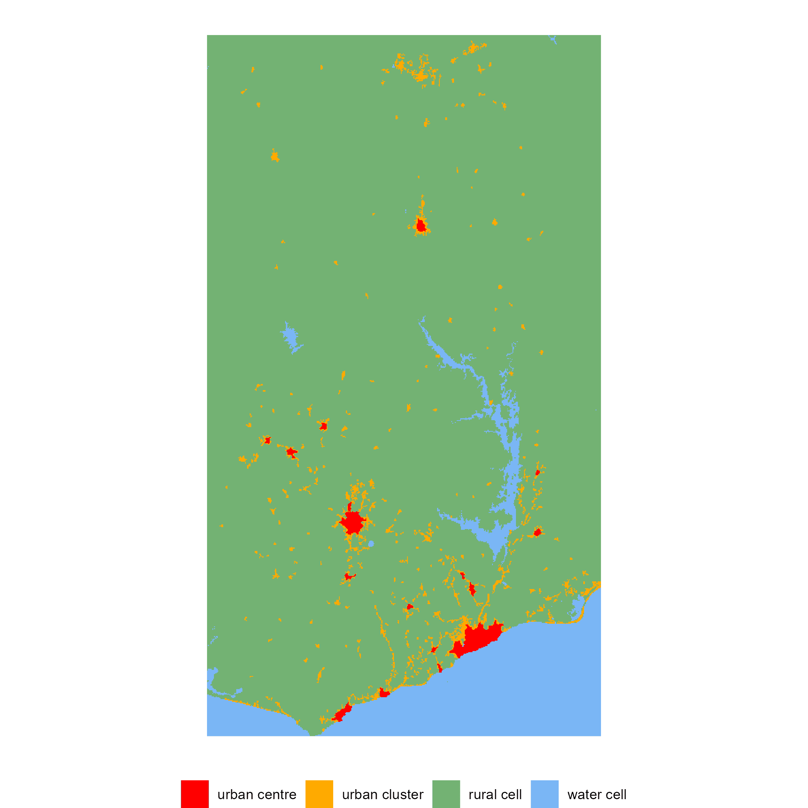
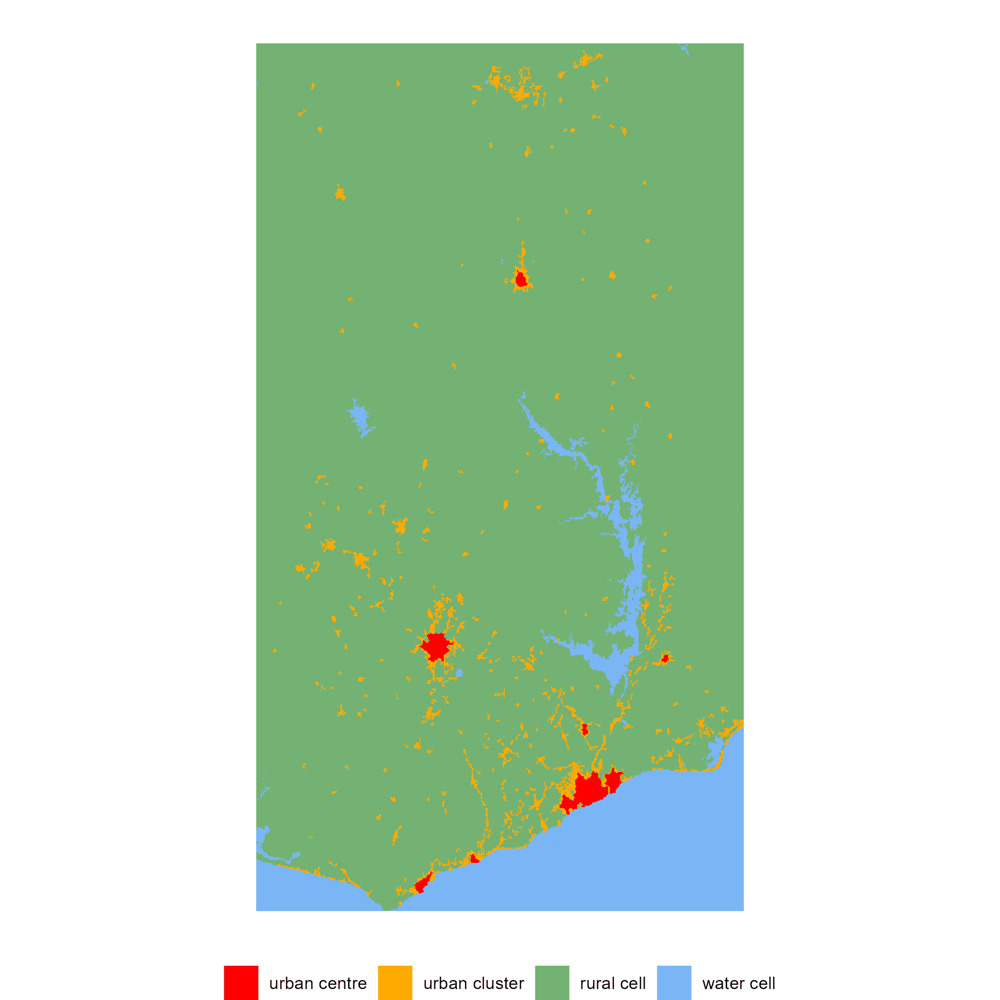

This vignette illustrates how to use the `flexurba` functionalities to reconstruct the Degree of Urbanisation classification with other population grids. The package standard uses the [GHSL-POP grid](https://human-settlement.emergency.copernicus.eu/ghs_pop2023.php) to generate an alternative version of the DEGURBA classification (with the function `download_GHSLdata()`), but any other population grid can be used in principle. In this vignette, we employ the [*WorldPop constrained UN adjusted population grid of Ghana*](https://hub.worldpop.org/geodata/summary?id=49691) with a resolution of 100m as an example (Bondarenko et al., 2020).

## Required format

To be able to apply the `flexurba` functions, you need to ensure that the population grid is in the right format. There are three key points to keep in mind:

-   The DEGURBA methodology is designed to be applied to a population grid with **a resolution of 1 km²** (for more information regarding why 1 km², see [Eurostat, 2021](https://ec.europa.eu/eurostat/statistics-explained/index.php?title=Applying_the_degree_of_urbanisation_manual)). As a consequence, the `flexurba`'s `DoU_classify_grid()` function only produces a classification when a grid of 1 km² is provided.

-   The population grid should be in an **equivalent** (=equal area) coordinate reference system to ensure that every grid cell covers the same surface area. Therefore, the `flexurba` functions only accept grids in the [Mollweide](https://en.wikipedia.org/wiki/Mollweide_projection) equivalent projection (with EPSG: 54009).

-   Three different data sources are required to execute the grid classification: (1) a population grid, (2) a built-up area grid, and (3) a land surface grid. All three grids need to be exactly aligned.

Below, we illustrate one possible approach to preprocess a population grid while ensuring that the three aforementioned points are respected. It is important to note that this is just one of many possible options.

## Read and reproject the population grid

Let's try to use the WorldPop data to produce the grid classification for Ghana. First, load the necessary libraries, and create a folder `data-ghana` to save the data.

```{r, eval=FALSE, message=FALSE, warning=FALSE}
library(flexurba)
library(terra)      # package used for processing raster data
library(ggplot2)    # package used for plotting
library(tidyterra)  # package used for plotting raster data
```

```{r, eval=FALSE}
# create a directory to save the data
dir.create('data-ghana')
```

Then, go to the [WorldPop download page](https://hub.worldpop.org/geodata/summary?id=49691) in your browser, download the population grid, and place it in the `data-ghana` folder. After doing that, we can read and plot the population grid as follows.

```{r, eval=FALSE}
# load the population grid
worldpop_ghana <- terra::rast('data-ghana/gha_ppp_2020_UNadj_constrained.tif')
```

```{r, eval=FALSE, message=FALSE}
#| fig.alt: >
#|   WorldPop Population in Ghana
# plot the population grid
ggplot() +
  # add the raster data
  geom_spatraster(data = worldpop_ghana) +
  # define color pallette
  scale_fill_continuous(low='antiquewhite', high='red', na.value=NA) +
  # add labels
  theme_minimal() +
  labs(
    fill = "Population Count",
    title = "WorldPop Population in Ghana"
  )
```

{alt="WorldPop Population in Ghana"}

Also, many of the cells contain `NA`-values, even within the country's borders. We replace these values with `0`.

```{r, eval=FALSE}
terra::set.values(worldpop_ghana, which(is.na(worldpop_ghana[])), 0)
```

As mentioned earlier, the `flexurba` functions expect a population grid in the Mollweide projection system. Let's check the coordinate system of the data and change it to Mollweide. Here, we employ the weighted sum of all non-NA contributing cells (`method="sum"`), but see `terra::project()` for more options.

```{r, eval=FALSE}
# print the crs
terra::crs(worldpop_ghana, describe=TRUE)
```

```{r}
##     name authority code  area             extent
## 1 WGS 84      EPSG 4326 World -180, 180, -90, 90
```


```{r, eval=FALSE}
# reproject the population grid to Mollweide
worldpop_ghana <- worldpop_ghana %>% 
  project('ESRI:54009', method='sum')
```

## Get built-up and land grid

Besides the population grid, we also need a built-up area and land grid to execute the grid cell classification. Here, we use the built-up area and land grid from the [Global Human Settlement Layer](https://human-settlement.emergency.copernicus.eu/index.php) (but note that other grids can be used as well).

First, we download the global GHSL built-up and land grid with the function `download_GHSLdata()`.

```{r, eval=FALSE}
# download the GHSL data on a global scale and save it in
# the directory "data-global"
download_GHSLdata(output_directory = "data-global", 
                  products = c('BUILT_S', 'LAND'),
                  filenames = c('BUILT_S.tif', 'LAND.tif'))
```

Then, we crop these global grids to the same geographical extent as our WorldPop population grid (`worldpop_ghana`) and save them in the folder `data-ghana` under the filenames `BUILT_S.tif` and `LAND.tif`.

```{r, eval=FALSE}
# built-up grid
built_grid <- terra::crop(rast('data-global/BUILT_S.tif'), 
            terra::ext(worldpop_ghana), 
            filename='data-ghana/BUILT_S.tif')

# land grid
land_grid <- terra::crop(rast('data-global/LAND.tif'), 
            terra::ext(worldpop_ghana), 
            filename='data-ghana/LAND.tif')
```

Let's take a look at the properties of the built-up and land grids. We see that the `resolution` of these grids is 1000 m, that the grids are already in the Mollweide coordinate system (see `coord. ref.`), and that the grids are perfectly aligned (see `dimensions` and `extent`).

```{r, eval=FALSE}
built_grid
```

```{r}
## class       : SpatRaster 
## dimensions  : 792, 445, 1  (nrow, ncol, nlyr)
## resolution  : 1000, 1000  (x, y)
## extent      : -326000, 119000, 586000, 1378000  (xmin, xmax, ymin, ymax)
## coord. ref. : World_Mollweide 
## source      : BUILT_S.tif 
## name        : BUILT_S 
## min value   :       0 
## max value   :  703173
```

```{r, eval=FALSE}
land_grid
```

```{r}
## class       : SpatRaster 
## dimensions  : 792, 445, 1  (nrow, ncol, nlyr)
## resolution  : 1000, 1000  (x, y)
## extent      : -326000, 119000, 586000, 1378000  (xmin, xmax, ymin, ymax)
## coord. ref. : World_Mollweide 
## source      : LAND.tif 
## name        :  LAND 
## min value   : 0e+00 
## max value   : 1e+06
```

We could actually use one of these grids to resample our `worldpop_ghana` population grid, to ensure that the population grid has a resolution of exactly 1000 m, and that all three grids are perfectly aligned. Here, we use `'sum'` as the resampling method. The value of the resampled cells will be calculated as the weighted sum of all non-NA contributing cells in the original cells, which makes sense since the values of the original grid are population counts. For more information about possible resampling methods, please consult the documentation of `terra::resample()`.

```{r, eval=FALSE}
# resample the population grid
worldpop_ghana <- terra::resample(worldpop_ghana, 
                                   built_grid, 
                                   method='sum')
  
# print the properties of the resulting grid
worldpop_ghana
```

```{r}
## class       : SpatRaster 
## dimensions  : 792, 445, 1  (nrow, ncol, nlyr)
## resolution  : 1000, 1000  (x, y)
## extent      : -326000, 119000, 586000, 1378000  (xmin, xmax, ymin, ymax)
## coord. ref. : World_Mollweide (ESRI:54009) 
## source(s)   : memory
## varname     : BUILT_S 
## name        : gha_ppp_2020_UNadj_constrained 
## min value   :                           0.00 
## max value   :                       24204.26
```

Let's double-check whether the three grid are exactly aligned.

```{r, eval=FALSE}
ext(worldpop_ghana) == ext(built_grid) &&  ext(worldpop_ghana) == ext(land_grid)
```

```{r}
## [1] TRUE
```

Great! Then, we save the pre-processed population grid as follows.

```{r, eval=FALSE}
# save the grid
writeRaster(worldpop_ghana ,'data-ghana/POP.tif')
```

## Execute the grid classification

Now that we have the population grid in the right format, we can use it to construct the grid cell classification of DEGURBA. The function `DoU_classify_grid()` reads the `POP.tif` (which contains our population grid), `BUILT_S.tif` and `LAND.tif` from the `data-ghana` folder and constructs the grid classification.

```{r, eval=FALSE}
# construct classification
classification1 <-DoU_classify_grid('data-ghana')

# plot the classification
DoU_plot_grid(classification1)
```

{alt="Ghana classification 2"}

Note that our population grid only contained counts inside Ghana, so the classification outside the country's borders might be inaccurate. It is advised to mask this classification layer with Ghana's country borders for further processing.

From here, you can start further analyses with the `flexurba` package. You can for example construct a spatial units classification in cities, towns, and rural analysis based on this grid classification (for more details and examples, see `vignette("vig1-level2")`), or you could explore different population thresholds as follows:

```{r, eval=FALSE}
# increase the population thresholds for urban centres
classification2 <-DoU_classify_grid('data-ghana', 
                                parameters = c(
                                  UC_density_threshold = 3000,
                                  UC_size_threshold = 100000
                                ))

# plot the classification
DoU_plot_grid(classification2)
```

{alt="Ghana classification 2"}

## References

Bondarenko M., Kerr D., Sorichetta A., and Tatem, A.J. (2020). Census/projection-disaggregated gridded population datasets, adjusted to match the corresponding UNPD 2020 estimates, for 51 countries across sub-Saharan Africa using building footprints. WorldPop, University of Southampton, UK. <https://hub.worldpop.org/doi/10.5258/SOTON/WP00683>.

Dijkstra, L., Florczyk, A. J., Freire, S., Kemper, T., Melchiorri, M., Pesaresi, M., & Schiavina, M. (2021). Applying the Degree of Urbanisation to the globe: A new harmonised definition reveals a different picture of global urbanisation. *Journal of Urban Economics, 125*, 103312. <https://doi.org/10.1016/j.jue.2020.103312>

Eurostat. (2021). Applying the Degree of Urbanisation—A methodological manual to define cities, towns and rural areas for international comparisons—2021 edition. <https://ec.europa.eu/eurostat/web/products-manuals-and-guidelines/-/ks-02-20-499>
