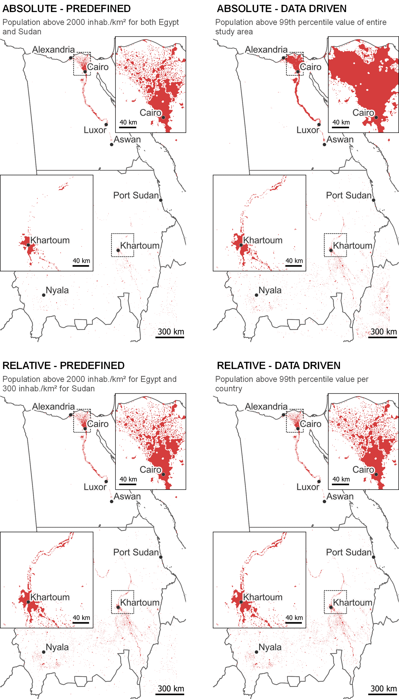

Constructing boundaries from gridded data typically requires setting rules to differentiate urban from rural areas. Most approaches rely on thresholds to guide this process. Thresholding approaches generally vary across two aspects: (1) how the threshold value is determined, and (2) how/where the threshold is enforced. This vignette elaborates on both aspects and demonstrates different thresholding approaches with the function `apply_threshold()` using data from Egypt and Sudan.

## Data preparation

To run the code in this vignette, you need to install the [`flexurbaData`](https://flexurbadata-ac82f4.pages.gitlab.kuleuven.be/index.html) package with the accompanying data.

```{r, eval=FALSE}
install.packages("remotes")
remotes::install_gitlab("spatial-networks-lab/research-projects/celine/flexurbaData",
  host = "https://gitlab.kuleuven.be/"
)
```

Here, we will employ population data to identify urban areas. The code below filters Egypt and Sudan from the `ne_country_borders` data and extracts population data in these countries based on the `processed-ghs-pop.tif` grid. Both datasets are provided within the `flexurbaData` package.

```{r, eval=FALSE}
library(flexurba)
library(flexurbaData)
library(dplyr)
library(terra)

# extract Egypt and Sudan
egypt_sudan <- ne_country_borders %>%
  filter(ISO %in% c("EGY", "SDZ"))

# get population data and crop to the extent of Egypt and Sudan
pop <- rast(system.file("proxies/processed-ghs-pop.tif",
  package = "flexurbaData"
)) %>%
  crop(ext(egypt_sudan))
```

## Aspect 1: How is the threshold value determined?

There are two main ways to determine a threshold's value. The value can be (1) **predefined** by the researcher or analyst, typically based on expert knowledge, or (2) **derived from the underlying data**. An example of the latter approach is to use the 99th percentile value of data distribution as threshold value to identify urban areas. There is considerable debate regarding whether predefined or data-driven thresholds should be preferred for urban delineation. Predefined thresholds are easier to understand and implement and thus contribute to a higher degree of transparency. However, their exact value is often difficult to justify, and they are relatively easy to change to suit one's purpose. Data-driven thresholds are more complex to adjust and are, therefore, perceived as less arbitrary. Nonetheless, it is important to note that concerns related to arbitrariness are not necessarily eliminated as the user still needs to decide on a particular function to derive the data-driven value. In that sense, it is actually moved from the value to the function. Furthermore, complex data-driven approaches may appear as a black box for some end users, as it might be difficult to retrace why a certain area is delineated as urban.

The function `apply_threshold()` implements both approaches. It applies a predefined threshold when `type="predefined"` and a data-driven threshold when `type="data-driven"`. The example code below constructs urban areas in Egypt and Sudan with (1) a predefined threshold of 2000 inhabitants per km² and (2) a data-driven threshold calculated as the 99th percentile value of the population density across the study area.

```{r, eval=FALSE}
# (1) predefined threshold of 2000 inhabitants per km²
predefined <- apply_threshold(
  grid = pop,
  type = "predefined",
  threshold_value = 2000
)

# (2) data-driven threshold of 99th percentile value across the study area
data_driven <- apply_threshold(
  grid = pop,
  type = "data-driven",
  fun = "p99"
)
```

The outputs contain three different variables: (1) `rboundaries` with a gridded version of the urban areas, (2) `vboundaries` with the urban areas saved as vector layer, (3) `threshold` with more details on the threshold value.

For instance, we can check the exact value of the data-driven threshold using the `threshold` variable in the code below. The 99th percentile value across the study area is, in this case, 523.1391 inhabitants per km², which is significantly lower than our predefined threshold value of 2000 inhabitants per km².

```{r, eval=FALSE}
pop_above_p99$threshold
#>  region_value threshold_value
#>1            1        523.1391
```

## Aspect 2: How/where is the threshold enforced?

A second aspect of a thresholding approach concerns how and where the threshold is enforced. This can be done in two main ways:

-   An **absolute approach**: the same threshold is applied consistently across the study area.

-   A **relative approach**: different thresholds are applied in separate regions.

In the code examples above, we employed an absolute approach. More specifically, in (1), we enforced the predefined threshold of 2000 inhabitants per km² consistently in Egypt and Sudan, and in (2), we calculated the 99th percentile using data from both countries and applied this threshold value in both countries.

A relative approach would entail applying different thresholds in the different countries. This could for example be used when the goal is to identify the most urbanised areas per country. Below, we employ a minimum of 2000 inhabitants per km² in Egypt and 300 inhabitants per km² in Sudan. The country borders in the object `egypt_sudan` are passed through the argument `regions`, indicating the relative approach.

```{r, eval=FALSE}
# predefined threshold of 2000 inhabitants per km² in Egypt and
# 300 inhabitants per km² in Sudan
predefined_relative <- apply_threshold(
  grid = pop,
  type = "predefined",
  regions = egypt_sudan,
  threshold_value = c(2000, 300)
)
```

However, when adopting a relative approach, threshold values are more often determined in a data-driven manner. For instance, we can determine the threshold separately for each country as the 99th percentile value of the country's data:

```{r, eval=FALSE}
# data-driven threshold of 99th percentile value per country
data_driven_relative <- apply_threshold(
  grid = pop,
  type = "data-driven",
  regions = egypt_sudan,
  fun = "p99"
)
```

In Egypt, the 99th percentile value is 2083.6820 inhabitants per km². The value for Sudan is only 282.5375 inhabitants per km².

```{r, eval=FALSE}
relative_datadriven$threshold
#>  region_value threshold_value ISO
#>1            0       2083.6820 EGY
#>2            1        282.5375 SDZ
```

The delineations generated by the four code examples are displayed below. Comparing the absolute-predefined approach (top left) with the relative-predefined approach (bottom left), we observe that the latter identifies more urban areas in Sudan because a less strict threshold is enforced in that country. Furthermore, when the data-driven threshold is applied in an absolute manner (using data from both Egypt and Sudan; top right) almost the entire Nile Delta is classified as urban. This is not the case when the threshold is tailored separately for each country.

{alt="Urban delineation from the four code examples." width="398"}

Ultimately, there is no definitive answer to what should be preferred: a predefined or data-driven threshold, enforced in an absolute or relative manner. Each approach possesses unique advantages yet also comes with limitations. We believe the choice of thresholding approach should depend on the purpose of the delineation and the context of the application. The function `apply_threshold()` allows you to explore the different approaches in order to make an informed decision in this regard.

## Thresholding approaches in the literature

Combining the possibilities of (1) how the threshold value is determined and (2) how/where it is enforced leads to four distinct thresholding approaches. Below, we give an example from the delineation literature of each of these approaches.

1.  **Predefined - Absolute**

    The *Degree of Urbanisation* definition developed by [Dijkstra et al. (2021)](https://doi.org/10.1016/j.jue.2020.103312) employs a predefined, absolute approach. It applies the predefined population density threshold of 1500 inhabitants per km² across the globe to identify urban centres.

2.  **Predefined - Relative**

    The [OECD (2013)](https://www.oecd.org/content/dam/oecd/en/publications/reports/2013/12/oecd-regions-at-a-glance-2013_g1g356f6/reg_glance-2013-en.pdf) specifies two distinct predefined thresholds to identify cities: a minimum of 1000 inhabitants per km² for the United States and Canada, and a threshold of 1500 inhabitants per km² for other OECD countries. They accordingly take a predefined, relative approach.

3.  **Data-driven - Absolute**

    [Jiang et al. (2015)](https://www.tandfonline.com/doi/full/10.1080/13658816.2014.988715) identify cities by determining a minimum night-time light emission threshold from the underlying data and enforcing this threshold consistently across the globe. The thresholding approach is thus absolute but data-driven.

4.  **Data-driven - Relative**

    [Combes et al. (2024)](https://documents1.worldbank.org/curated/en/099415311272320571/pdf/IDU0faef6c000aaba0485209f0e08928760d9a57.pdf) determined a separate data-driven population density threshold for each country in Sub-Saharan Africa, making their method relative and data-driven.
