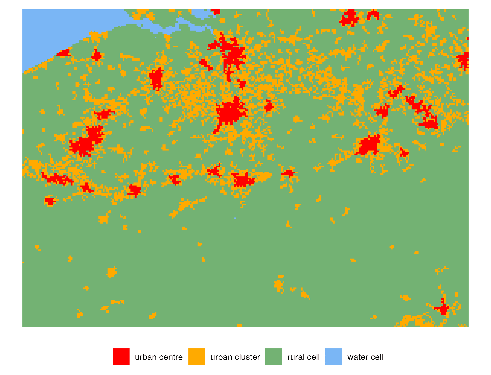

The `flexurba` package was originally designed to flexibly reconstruct the *Degree of Urbanisation* (DEGURBA) classification. This is an operational definition of cities, towns and rural areas that is developed to facilitate international statistical comparisons. `flexurba` provides flexibility to customise the standard parameters in the DEGURBA definition and evaluate the consequences of certain implementation choices. The user can construct alternative versions of DEGURBA by changing, for example, the minimum population thresholds, and even more 'hidden' implementation details, such as the contiguity requirements and edge smoothing rules. For an extensive description of the package and its contribution, please consult the following journal article:

*Van Migerode, C., Poorthuis, A., & Derudder, B. (2024). Flexurba: An open-source R package to flexibly reconstruct the Degree of Urbanisation classification. Environment and Planning B: Urban Analytics and City Science, 51(7), 1706-1714. <https://doi.org/10.1177/23998083241262545>*

## Degree of Urbanisation

The DEGURBA methodology consists of two consecutive stages: (1) a grid cell classification and (2) a spatial units classification. In the first stage, the cells of a 1 km² population grid are classified into three different categories based on the following rules, detailed in the [GHSL Data Package 2023](https://ghsl.jrc.ec.europa.eu/documents/GHSL_Data_Package_2023.pdf):

-   **Urban Centres** are clusters of cells (rooks continuity) with a minimum population density of 1500 inhabitants per km² of permanent land or a minimum 'optimal' built-up area threshold. In addition, the total population in these clusters should be at least 50 000. Gaps in the urban centres are filled and edges are smoothed.
-   **Urban Clusters** are clusters of cells (queens continuity) with a minimum population density of 300 inhabitants per km² of permanent land and a minimum total population of 5000 inhabitants. Cells that belong to urban centres are removed from urban clusters.
-   **Rural grid cells** do not belong to an urban centre or cluster.

In the second stage, small administrative or statistical spatial units are classified into (1) cities, (2) towns and semi-dense areas, (3) and rural areas based on the proportion of population in the three grid classes:

-   **Cities**: local units that have at least 50% of their population in urban centres.
-   **Towns and semi-dense areas**: local units that have less than 50% of their population in an urban centre and no more than 50% of their population in rural grid cells.
-   **Rural areas**: local units that have more than 50% of their population in rural grid cells.

For more information about the methodology, readers can consult [Dijkstra et al. 2021](https://www.sciencedirect.com/science/article/pii/S0094119020300838), [Eurostat 2021](https://ec.europa.eu/eurostat/statistics-explained/index.php?title=Applying_the_degree_of_urbanisation_manual) and [Global Human Settlement Layer website](https://ghsl.jrc.ec.europa.eu/degurba.php) (GHSL).

## Code example

Below is a basic example which shows how to use the ``flexurba` package to (1) download the required data from the GHSL website, (2) construct the grid cell classification and (3) construct the spatial units classification.

### 1. Download data products from the GHSL website

The grid classification of the Degree of Urbanisation requires three data sources: a population grid, built-up area grid and land grid. The code below demonstrates how the `flexurba` functions can be used to download the required data. Alternatively, the required data can be download from the [GHSL website](https://ghsl.jrc.ec.europa.eu/) directly.

```{r example1a, eval = FALSE}
library(flexurba)

# create a directory to save the data:
dir.create("data")

# make sure the time out is large enough to download all the data
options(timeout = 500)

# download the GHSL data on a global scale and save it in
# the directory "data/global"
download_GHSLdata(output_directory = "data/global")

# crop the global grid to a custom extent (here: Belgium) and save it
# in the directory "data/belgium"
# the coordinates of the extent should be provided in the Mollweide projection
crop_GHSLdata(
  extent = terra::ext(192000, 485000, 5821000, 6030000),
  global_directory = "data/global",
  output_directory = "data/belgium"
)
```

When employing the code above, the three data sources will be saved in the output directory as `POP.tif`, `BUILT.tif` and `LAND.tif` respectively.

### 2. Grid cell classification (stage 1)

Now that we have the data, we can construct the grid cell classification as follows.

```{r example1b, eval = FALSE}
# preprocess the data
data_belgium <- DoU_preprocess_grid("data/belgium")

# run the algorithm with the standard parameter settings
classification1 <- DoU_classify_grid(data = data_belgium)

# plot the resulting grid
DoU_plot_grid(classification1)
```

{alt="Grid classification 1" width="450"}

However, the `flexurba` package has more functionalities. The function `DoU_classify_grid()` allows the user to adapt various parameters in the classification algorithm, including the the minimum population thresholds or the smoothing rules.

The code below adapts the following parameter settings:

-   `UC_density_threshold = 1250`: the minimum density threshold for urban centres (`UC`) is changed to 1250 inhabitants per km² instead of the standard value of 1500 inhabitants per km².

-   `UC_size_threshold = 60000`: the minimum size threshold for urban centres (`UC`) is increased from 50 000 inhabitants to 60 000 inhabitants.

-   `UC_gap_fill = FALSE` and `UC_smooth_edge = FALSE`: urban centres are created without filling gaps and smoothing the edges.

```{r example1c, eval = FALSE}
# run the algorithm with custom parameter settings
classification2 <- DoU_classify_grid(
  data = data_belgium,
  parameters = list(
    UC_density_threshold = 1250,
    UC_size_threshold = 60000,
    UC_gap_fill = FALSE,
    UC_smooth_edge = FALSE
  )
)

# plot the resulting grid
DoU_plot_grid(classification2)
```

{alt="Grid classification 2" width="450"}

For more information about the possible parameters setting that can be adapted, readers can consult the section 'Custom specifications' in the documentation of `DoU_classify_grid()`.

### 3. Spatial units classification (stage 2)

Based on the grid classification, the spatial units classification can be constructed with the following code. The data object `flexurba::units_belgium` is used, containing spatial units of the municipalities in Belgium.

```{r example2b, eval = FALSE}
# preprocess the data
data1 <- DoU_preprocess_units(
  units = flexurba::units_belgium,
  classification = classification1,
  pop = "data/belgium/POP.tif"
)

# run the algorithm for the units classification
units_classification <- DoU_classify_units(data1)

# visualise the results
plot_units(flexurba::units_belgium, classification = units_classification)
```

{alt="Units classification 1" width="450"}

*Please note that the classification functions are computationally quite heavy. Please use a small study area to start with. As a reference: the grid classification for the European continent takes approximately 187 seconds and requires around 10 GB RAM.*