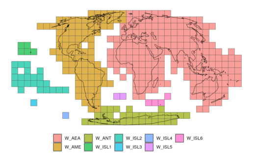

One of the contributions of the DEGURBA methodology is that it provides a *globally consistent* definition of cities, towns and rural areas, which enables comparative urban research.

The following vignette gives an overview on how to use the `flexurba` package to construct the grid cell classification **on a global scale**. Please note that this requires a large amount of memory (see technical requirements below).

```{r, include = FALSE}
knitr::opts_chunk$set(
  collapse = TRUE,
  comment = "#>"
)
```

### Splitting the globe in different regions

Because of the large amount of data at a global scale, the grid classification procedure is quite memory-consuming. As an example, the global [GHSL population grid](https://ghsl.jrc.ec.europa.eu/ghs_pop2023.php) (1 km² resolution) has dimensions 36082 x 18000 and contains almost 650 million cells.

To optimise the classification procedure, we divided the world in 9 pre-defined regions. These regions are the smallest possible grouping of [GHSL tiles](https://ghsl.jrc.ec.europa.eu/download.php), ensuring that no continuous land mass is split across two regions (this ensures that continuous cities and towns are identified correctly). These 9 pre-defined regions can be employed to execute the grid cell classification in a memory-efficient manner.

The 9 regions cover approximately the following areas:

-   **W_AEA:** Asia - Europe - Africa - Oceania (eastern hemisphere)

-   **W_AME:** North and South America (+ Greenland and Iceland)

-   **W_ISL1:** Hawaii

-   **W_ISL2:** Oceanic Islands (western hemisphere)

-   **W_ISL3:** Chatham Islands

-   **W_ISL4:** Scott Island

-   **W_ISL5:** Saint-Helena, Ascension and Tristan da Cunha

-   **W_ISL6:** French Southern and Antarctic Lands

-   **W_ANT:** Antarctic

    {alt="GHSL tiles per region"}

### Download the GHSL data in the pre-defined regions

To execute the grid cell classification in these pre-defined region, we need to download and prepare the data in the right format. This can be achieved by setting the parameter `extent = "regions"`in the function `download_GHSLdata()`. The population, built-up area and land grid will be downloaded for each region separately and saved in a sub-directory of the `output_directory` (e.g., for region `W_AME`, the directory `data_in_regions/W_AME` is created).

```{r setup}
library(flexurba)
```

```{r, eval=FALSE}
# create a directory to save the data
dir.create("data_in_regions")

# the function requires downloading a large amount of data
# make sure the timeout is sufficiently large
options(timeout = 500)

# download the data
download_GHSLdata(
  output_directory = "data_in_regions",
  extent = "regions"
)
```

### Execute the grid cell classification

To execute the grid classification in these pre-defined regions, we can use the function `DoU_classify_grid()` with the parameter setting `regions=TRUE`. The grid classification procedure will be executed separately in each of the 9 regions and the results are afterwards merged together to produce a global grid classification.

```{r, eval=FALSE}
global_classification <-DoU_classify_grid(
  data = "data_in_regions",
  regions = TRUE
)
```

### Technical requirements

Although that executing the grid cell classification in the 9 pre-defined regions is the most efficient manner to produce a global grid cell classification, the procedure is still memory- and time-consuming. Executing the algorithm with the standard specifications, takes approximately 145 minutes and requires 116 GB RAM (performed on a server with 256 GB RAM available). It is thus not advised to execute a global grid classification on a regular laptop. Instead, we advise to use a server with increased RAM, or to focus on a specific country or a study area.
