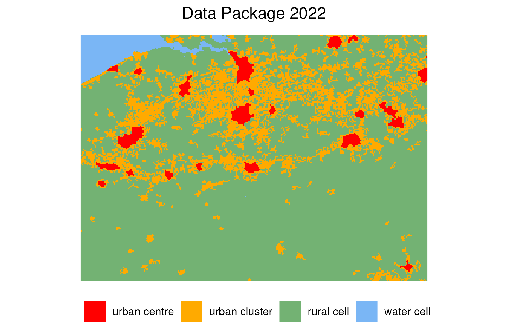
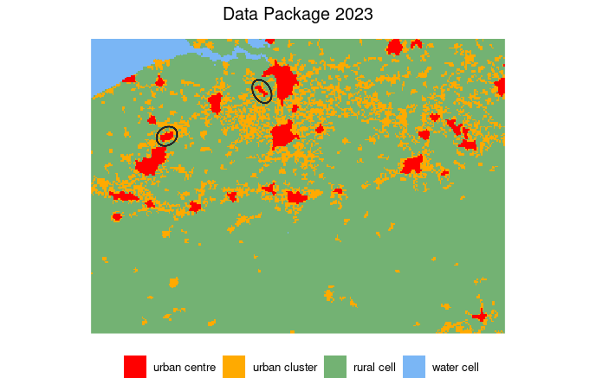
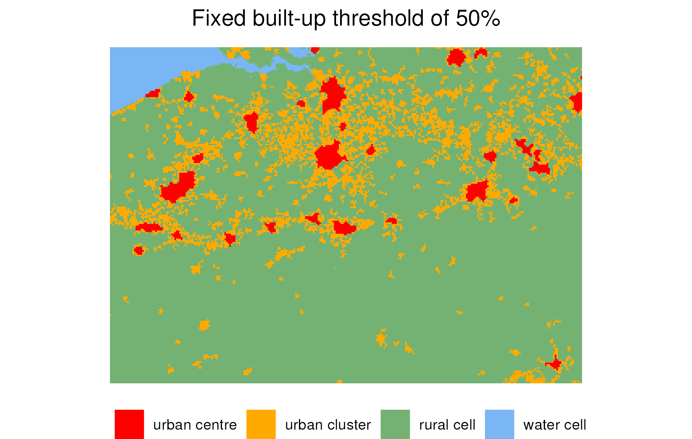
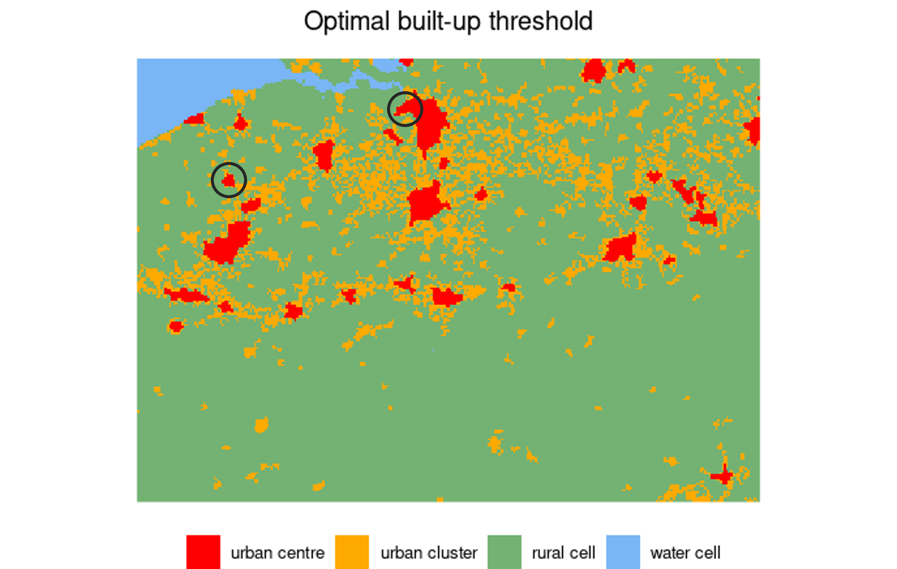

The Degree of Urbanisation methdology is regularly updated in the context of the [Global Human Settlement Layer (GHSL)](https://ghsl.jrc.ec.europa.eu/index.php) project. In this project, new Data Packages are released in which new data products are published and the implementation details in the DEGURBA algorithm are slightly adapted. The data products include updated population ([GHS-POP](https://ghsl.jrc.ec.europa.eu/ghs_pop2023.php)) and built-up area grids ([GHS-BUILT-S](https://ghsl.jrc.ec.europa.eu/ghs_buS2023.php)), alongside with new results of the grid classification ([GHS-SMOD](https://ghsl.jrc.ec.europa.eu/ghs_smod2023.php)) and units classification ([GHS-DUC](https://ghsl.jrc.ec.europa.eu/ghs_duc2023.php)) of the Degree of Urbanisation.

The `flexurba` package supports two recent versions of the Degree of Urbanisation: the version as described in [GHSL Data Package 2022](https://ghsl.jrc.ec.europa.eu/documents/GHSL_Data_Package_2022.pdf) and the version as described in [GHSL Data Package 2023](https://ghsl.jrc.ec.europa.eu/documents/GHSL_Data_Package_2023.pdf). In that way, `flexurba` enables monitoring the differences between the different versions and assessing the effect of changes in specific implementation details.

This vignette demonstrates how `flexurba` can be used to compare the results of the two different GHSL Data Packages.

```{r, include = FALSE}
knitr::opts_chunk$set(
  collapse = TRUE,
  comment = "#>"
)
```

### Changes in implementation

There are three main differences in the grid classification of the Degree of Urbanisation as described in Data Package 2023 compared to Data Package 2022:

**1. Data sources**:

The DEGURBA grid classification relies on a population grid, built-up area grid and land grid. In Data Package 2023, the GHSL released updated population and built-up area grids. The results of the grid cell classification will be affected by these updated data products.

**2. Built-up area criterium**:

In Data Package 2022, DEGURBA included a fixed minimum built-up area threshold of 50% for urban centres to account for the presence of office parks, shopping malls, factories, and transport infrastructure. Urban centres were created using cells with at least 1500 inhabitants per km² and cells with at least 50% built-up area.

In Data Package 2023, the built-up area rule is slightly adapted: a minimum 'optimal' built-up threshold is employed, instead of the minimum fixed threshold of 50% built-up area. This 'optimal' threshold (as defined in [GHSL Data Package 2023](https://ghsl.jrc.ec.europa.eu/documents/GHSL_Data_Package_2023.pdf) on page 51 footnote 30), is dynamically identified as the average proportion of built-up density in clusters with a density of at least 1500 inhabitants per km² and at least a total population of 5000. The built-up area criterium is also referred to as the *Reduce Fragmentation Option*.

The change from a fixed built-up area threshold to a dynamically determined 'optimal' built-up area threshold will affect which cells are considered when identifying urban centres, and consequently influence the results of the grid cell classification.

**3. Edge smoothing: majority rule algorithm**

In Data Package 2022, edges of urban centres are smoothed by an iterative majority rule. The majority rule works as follows: if a cell has at least five of the eight surrounding cells belonging to an unique urban centre, then the cell is added to that urban centre. The process is iteratively repeated until no more cells are added.

In Data Package 2023, the majority rule is slightly adapted. A cell is added to an urban centre if the majority of the surrounding cells belongs to an unique urban centre, with majority *only* computed among populated or land cells (proportion of permanent land larger than 50%). In addition, cells with permanent water can never be added to urban centres. The process is iteratively repeated until no more cells are added.

The change in the edge smoothing rule affects which cells are classified as urban centres and consequently influences the results of the grid cell classification.

### Assessment of the effect of these changes

The `flexurba` package can be used to reconstruct the grid classification of both Data Package 2022 and Data Package 2023, and thus facilitates assessing the effect of changes in the implementation details.

As illustration, we will compare the results of the grid classification in Belgium.

```{r setup}
library(flexurba)
```

First, we need to download the required data sources of the two different Data Packages from the GHSL website. We download for both Data Packages the data of epoch 2020.

```{r, eval=FALSE}
# create a directory to save the data:
dir.create("data")

# make sure the time out is large enough to download all the data
options(timeout = 500)
```

For Data Package 2022, the data can be downloaded by setting the parameter `release="R2022A"` in the function `download_GHSLdata()`:

```{r, eval=FALSE}
# download the GHSL data of Data Package 2022 on a global scale 
# and save it in the directory "data/global2022"
download_GHSLdata(
  output_directory = "data/global2022",
  release = "R2022A"
)

# crop the global files to a custom extent (here: Belgium) 
# and save it in the directory "data/belgium2022"
crop_GHSLdata(
  extent = terra::ext(192000, 485000, 5821000, 6030000),
  global_directory = "data/global2022",
  output_directory = "data/belgium2022"
)
```

For Data Package 2023, the parameter `release` in the function `download_GHSLdata()` should be set to `"R2023"`.

```{r, eval=FALSE}
# download the GHSL data of Data Package 2023 on a global scale 
# and save it in the directory "data/global2023"
download_GHSLdata(
  output_directory = "data/global2023",
  release = "R2023A"
)

# crop the global files to a custom extent (here: Belgium) 
# and save it in the directory "data/belgium2023"
crop_GHSLdata(
  extent = terra::ext(192000, 485000, 5821000, 6030000),
  global_directory = "data/global2023",
  output_directory = "data/belgium2023"
)
```

Next, we can execute the grid cell classification with the function `DoU_classify_grid()`. The `parameters` in the function should contain the specification as described below to precisely reconstruct the results of the two different Data Packages.

**For Data Package 2022:**

-   The fixed built-up area criterium of 50% is reproduced by the parameter setting `UC_built_threshold = 0.5`.

-   The edge smoothing rule as described in the Data Package 2022 is reproduced by `UC_smooth_edge_fun = "majority_rule_R2022A"`.

```{r, eval=FALSE}
# create the grid cell classification according to Data Package 2022
classification2022 <-DoU_classify_grid(
  data = "data/belgium2022",
  parameters = list(
    UC_built_threshold = 0.5,
    UC_smooth_edge_fun = "majority_rule_R2022A"
  )
)
```

**For Data Package 2023:**

-   The 'optimal' built-up area criterium is reproduced by the following two parameter settings:
    -   `UC_built_threshold = "optimal"` indicates that an "optimal" built-up area threshold should be determined. This 'optimal' threshold, as defined in [Data Package 2023](https://ghsl.jrc.ec.europa.eu/documents/GHSL_Data_Package_2023.pdf), is calculated as the average built-up area proportion in clusters of cells with a density of at least 1500 inhabitants per km² and a minimum total population of 5000 people. The `flexurba` function `DoU_get_optimal_builtup()` is employed for this calculation.

    -   `built_optimal_data = "data/global2023"` determines which data sources are used to determine the 'optimal' built-up threshold. In this case, we employ the global data of Data Package 2023, as this reproduces the results of the official [GHSL SMOD layer](https://ghsl.jrc.ec.europa.eu/ghs_smod2023.php).
-   The edge smoothing rule as described in Data Package 2023 is reproduced by the parameter setting `UC_smooth_edge_fun = "majority_rule_R2023A"`.

```{r, eval=FALSE}
# create the grid cell classification according to Data Package 2023
# (Note that determining the "optimal" built-up area 
# from the global data can take some time)
classification2023 <-DoU_classify_grid(
  data = "data/belgium2023",
  parameters = list(
    UC_built_threshold = "optimal",
    built_optimal_data = "data/global2023",
    UC_smooth_edge_fun = "majority_rule_R2023A"
  )
)
```

For more information about all possible parameter settings of the reader can consult the section 'Custom specification' in the documentation of the function `DoU_classify_grid()`.

The resulting grid classifications are visualised below. There are some differences between the two classifications. Data Package 2022 contains only 22 distinct urban centres in the extent, while Data Package 2023 contains 31. In particular, mid-sized cities such as *Sint-Niklaas* and *Kortrijk* (displayed in the black circles) are classified as urban centre in Data Package 2023, but not in Data Package 2022. In addition, the coverage of the urban clusters is decreased in Data Package 2023.

The differences in classification are the result of the combination of (1) the updated data products, (2) the changed built-up area criterium and (3) the changed edge smoothing rule.

{width=450}

{width=450}

### Assessment of the isolated effect of changing one parameter

Besides comparing the results of the two Data Packages, the `flexurba` package allows us to go one step further and assess the *isolated* effect of changing one single specification on the grid cell classification. As an example, we can answer questions such as: *"To what extent is the grid cell classification influenced by the changed built-up area criterium?"*.

To answer this question, we construct two different grid classifications: we keep the data and the edge smoothing rule constant, and vary only the built-up area criterium. In this way, the differences are solely attributed to this criterium.

In the code below, we use the data and the edge smoothing rule from Data Package 2023 for both classifications (we don't need to specify the latter in the `parameters` argument, as this is the standard parameter setting). In the first classification, we employ a fixed built-up threshold of 50% (`UC_built_threshold = 0.5`), while in the second classification, we employ an 'optimal' threshold value (`UC_built_threshold="optimal"`) which will be calculated based on the global data of Data Package 2023 (`built_optimal_data="data/global2023"`).

```{r, eval=FALSE}
# With built-up area criterium of Data Package 2022: fixed threshold of 50%
classification_builtup2022 <-DoU_classify_grid(
  data = "data/belgium2023",
  parameters = list(UC_built_threshold = 0.5)
)

# With built-up area criterium of Data Package 2023: "optimal" threshold
# (Note that determining the "optimal" built-up area 
# from the global data can take some time)
classification_builtup2023 <-DoU_classify_grid(
  data = "data/belgium2023",
  parameters = list(
    UC_built_threshold = "optimal",
    built_optimal_data = "data/global2023"
  )
)
```

More specifically, the 'optimal' built-up area, as defined in Data Package 2023, is dynamically identified as the global average built-up density in clusters (rook contiguity) with a density of at least 1500 inhabitants per km² of permanent land and a minimum total population of 5000 people.

For the data of epoch 2020 in Data Package 2023, we can determine the exact value of this 'optimal' threshold with the function `DoU_get_optimal_builtup()`:

```{r, eval=FALSE}
# (Note that determining the "optimal" built-up area 
# from the global data can take some time)
DoU_get_optimal_builtup("data/global2023",
  density_threshold = 1500,
  size_threshold = 5000,
  directions = 4
)
#> [1] 0.1930322
```

According to our calculations, the 'optimal' threshold for 2020 is a built-up area proportion of 19.30%. However, when comparing the classification with a 19.30% built-up threshold with the official [GHSL SMOD](https://ghsl.jrc.ec.europa.eu/ghs_smod2023.php) grid classification, we noticed some differences in classification. But with some trial and error, we discovered that when employing a 20% built-up threshold, we were able to reproduce the [GHSL SMOD](https://ghsl.jrc.ec.europa.eu/ghs_smod2023.php) almost exactly. Hence, it appears that the DEGURBA methodology uses the rounded up (ceiled) value of the optimal threshold.

We consequently empirically determined that the 'optimal' threshold used by the GHSL in epoch 2020 is a minimum built-up threshold hold of 20%. This means that both cells with at least 1500 inhabitants per km² and cells with at least 20% built-up area are considered when identifying urban centres.

Changing the built-up area criterium from a fixed threshold of 50% (in Data Package 2022) to an 'optimal' threshold (in Data Package 2023) thus actually implies decreasing the threshold from 50% to 20% for epoch 2020. This decrease has significant implications, as illustrated by the results for Belgium below. More cells are classified as urban centre (e.g., in the Port of Antwerp) and even new urban centres (e.g., the city of *Roeselare*) appear (both displayed with black circle below).

{width=450}

{width=450}

With a similar approach, the `flexurba` package could be used to assess the (potentially spatially-explicit) sensitivity to other parameters of variation in the algorithm.
