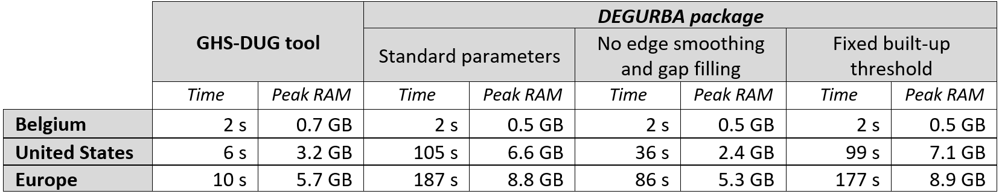

This vignettes describes on the computational requirements (time + memory requirements) of the `flexurba` package and compares them with the official [GHSL tools](https://ghsl.jrc.ec.europa.eu/tools.php).

The grid cell classification requires processing a large amount of data, especially when executed at a regional or global scale. For example, the European continent contains more than 32 million cells; globally there are nearly 650 million cells. To tackle this issue, most of the functions in the `flexurba` package rely on `terra`, a well-established framework in R that can handle data files that are too large to load into memory (see [Hijmans et al. 2023](https://cran.r-project.org/web/packages/terra/index.html)). We have tried our best to optimise the most time-consuming functions First, part of the majority rule procedure in `apply_majority_rule()` is written in fast C++ code (through Rcpp; [Eddelbuettel et al., 2023](https://cran.r-project.org/web/packages/Rcpp/index.html)). Second, we wrote our own `get_patches()` function, which reduces execution time for large data sets in comparison with the standard `terra::patches()` function (for more details, see `get_patches()`. Third, we ensure efficient memory use for global grid classification by providing a functionality to process independent regions separately (for more information, see `vignette("vig3-global-scale")`).

For detailed information on the package performance, see the profile of the `classify_grid()` function applied to Belgium under `inst/profile-classify-grid.Rprofvis` on the GitLab repository.

However, the `flexurba` package is still slower and requires slightly more memory than the existing [GHSL tools](https://ghsl.jrc.ec.europa.eu/tools.php). The table below reports the computational requirements of the level 2 grid classification for the [GHS-DUC tool](https://ghsl.jrc.ec.europa.eu/tools.php) and the `flexurba` package for three different regions. The calculations were performed on a Windows laptop with a 2.30 GHz Intel Core i7-11800H processor with 32.0 GB of memory. Peak RAM usage was monitored via Task Manager, the time is computed with the R function `system.time()`.

Within the `flexurba` package, the computation time and required RAM depends on the parameter settings. Edge smoothing and gap filling are some of the most computationally expensive steps of the algorithm. Disabling the edge smoothing significantly decreases both the time and peak RAM. In addition, using a fixed built-up density threshold also reduces the required time, as no 'optimal' threshold needs to be inferred from the data.

Although the package is slower than the [GHS-DUC tool](https://ghsl.jrc.ec.europa.eu/tools.php), it does contribute significantly to the usability of the Degree of Urbanisation. More specifically, the package offers enhanced flexibility, works across all major operating systems, integrates seamlessly into other data science workflows and allows users to tailor the methodology to their specific needs. It thus enables a broader range of analyses beyond the DEGURBA's direct application.

*Table: Computational requirements to execute the grid cell classification (level 2)* {alt="computational requirements table"}
