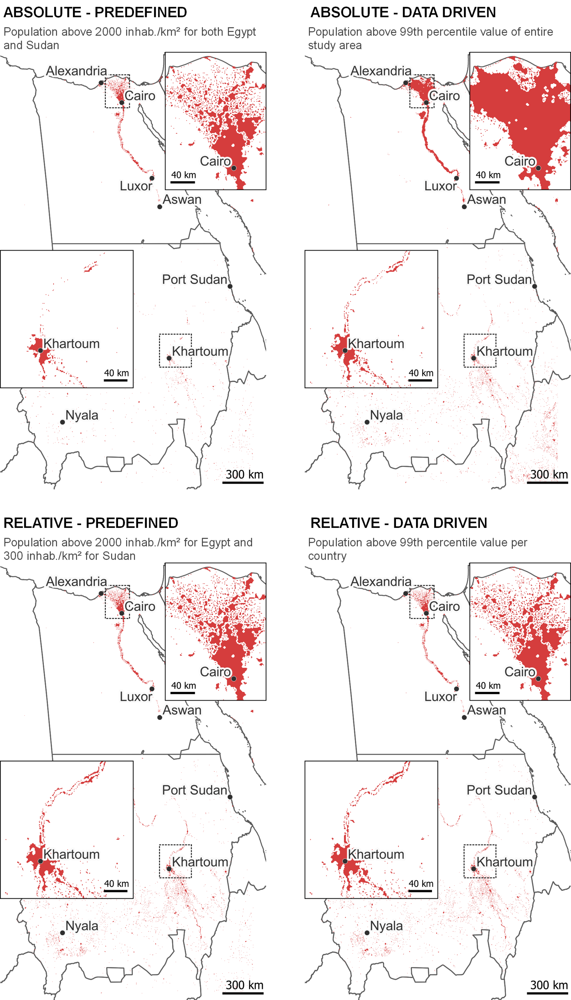

Constructing boundaries from gridded data typically requires setting rules to differentiate urban from rural areas. Most approaches rely on thresholds to guide this process. Thresholding approaches generally vary across two aspects: (1) how the threshold value is determined, and (2) how/where the threshold is enforced. This vignette elaborates on both aspects and demonstrates different thresholding approaches with the function `apply_threshold()` using data from Egypt and Sudan.

### Data preparation

To run the code in this vignette, you need to install the [`flexurbaData`](https://flexurbadata-ac82f4.pages.gitlab.kuleuven.be/index.html) package with the accompanying data.

```{r, eval=FALSE}
install.packages("remotes")
remotes::install_gitlab("spatial-networks-lab/research-projects/celine/flexurbaData",
                        host="https://gitlab.kuleuven.be/")
```

Here, we will employ population data to identify urban areas. The code below filters the borders of Egypt and Sudan from the `ne_country_borders` data and extracts population data in these borders based on the `processed-ghs-pop.tif` grid Both datasets are provided within the [`flexurbaData`](https://flexurbadata-ac82f4.pages.gitlab.kuleuven.be/index.html) package.

```{r, eval=FALSE}
library(flexurba)
library(flexurbaData)
library(dplyr)
library(terra)

# extract country borders of Egypt and Sudan
egypt_sudan <- ne_country_borders %>%
  filter(ISO %in% c('EGY', 'SDZ'))
  
# get population data and crop to the extent of Egypt and Sudan
pop <- rast(system.file("proxies/processed-ghs-pop.tif", 
                               package = "flexurbaData")) %>% 
          crop(ext(egypt_sudan))
```

### Aspect 1: How is the threshold value determined?

There are two main ways to determine a threshold's value. The value can be (1) **predefined** by the researcher or analyst, typically based on expert knowledge, or (2) **derived from the underlying data**. There is considerable debate regarding whether predefined or data-driven thresholds should be preferred for urban delineation. Predefined thresholds are easier to understand and implement and thus contribute to a higher degree of transparency. However, their exact value is often difficult to justify, and they are relatively easy to change to suit one's purpose. Data-driven thresholds are more complex to adjust and are therefore perceived as less arbitrary. Nonetheless, it is important to note that concerns related to arbitrariness are not necessarily eliminated as the user still needs to decide on a particular function to derive the data-driven value. In that sense, arbitrariness is moved from the value to the function. Additionally, data-driven thresholds may appear as black box for some end users.

The function `apply_threshold()` implements both approaches. It applies a predefined threshold when `type="predefined"` and a data-driven threshold when `type="data-driven"`. The example code below constructs urban areas in Egypt and Sudan with (1) a predefined threshold of 1500 inhabitants per km² and (2) a data-driven threshold calculated as the 99th percentile value of the population density across the study area.

```{r, eval=FALSE}
# (1) predefined threshold of 1500 inhabitants per km²
pop_above_1500 <- apply_threshold(grid = pop, 
                                  type="predefined", 
                                  threshold_value = 1500)

# (2) data-driven threshold of 99th percentile value across the study area
pop_above_p99 <- apply_threshold(grid = pop, 
                                 type="data-driven", 
                                 fun = "p99")
```

We can check the exact value of the data-driven threshold with the code below. The 99th percentile value across the study area is in this case 523.1391 inhabitants per km², which is significantly lower than our predefined threshold value.

```{r, eval=FALSE}
pop_above_p99$threshold
#>  region_value threshold_value
#>1            1        523.1391
```

### Aspect 2: How/where is the threshold enforced?

A second aspect of a thresholding approach concerns how and where the threshold is enforced. This can be done in two main ways:

-   An **absolute approach**: The same threshold is applied consistently across the study area.

-   A **relative approach**: Different thresholds are applied in separate regions.

In the code examples above, we employed an absolute approach. More specifically, in (1) we enforced the predefined threshold of 1500 inhabitants per km² consistently in Egypt and Sudan, and in (2) we calculated the 99th percentile using data from both countries and also applied this value in both countries. 

A relative approach would entail applying different thresholds. Below, we apply different predefined thresholds in the two countries: a minimum of 1500 inhabitants per km² in Egypt and 300 inhabitants per km² in Sudan. The country borders in the object `egypt_sudan` are passed through the argument `regions`, indicating the relative approach.

```{r, eval=FALSE}
# predefined threshold of 1500 inhabitants per km² in Egypt and 
# 300 inhabitants per km² in Sudan
relative_predefined <- apply_threshold(grid = pop, 
                                       type="predefined", 
                                       regions = egypt_sudan, 
                                       threshold_value = c(1500, 300))
```

However, when adopting a relative approach, threshold values are more often determined in a data-driven manner. For example, we can determine for each country separately the 99th percentile value:

```{r, eval=FALSE}
# data-driven threshold of 99th percentile value per country
relative_datadriven <- apply_threshold(grid = pop, 
                                        type="data-driven",
                                        regions = egypt_sudan,
                                        fun = "p99")
```

We can check the data-driven threshold values using the code below. In Egypt, the 99th percentile value is 2083.6820 inhabitants per km², which is higher than our predefined threshold of 1500 inhabitants per km². In contrast, the data-driven value in Sudan is lower than our predefined value applied above.

```{r, eval=FALSE}
relative_datadriven$threshold
#>  region_value threshold_value ISO
#>1            0       2083.6820 EGY
#>2            1        282.5375 SDZ
```

This approach allows the threshold to be tailored to the specific urbanisation pattern of a country. For example, we could apply a higher threshold in Egypt which is considered "more urbanised" than Sudan. However, because urban areas in Egypt are identified with a different threshold than urban areas in Sudan, it might not be possible to meaningfully compare the urbanisation pattern between these countries. In contrast, absolute thresholds ensure that urban areas are identified consistently across space, allowing for more meaningful comparisons.

The delineations constructed by the four code examples are shown below. More areas are classified in Sudan relative compared to Egypt in in the relative appraoches than in the absolute approaches, because less strict thresholds are enforced in the former country. There are also differences in urban delineation using predefined and data-driven thresholds, but these are solely attributable to the fact that the 99th percentile value derived from the data is different from our predefined threshold values.

{alt="Urban delineation from the four code examples." width="398"}

### Examples of different thresholding approaches in the literature

Combining the possibilities of (1) how the threshold value is determined, and (2) how/where it is enforced leads to four distinct thresholding approaches. Below, we give an example from the delineation literature of each of these approaches.

1.  **Predefined - Absolute**

    The *Degree of Urbanisation* definition developed by [Dijkstra et al. (2021)](https://www.sciencedirect.com/science/article/pii/S0094119020300838) employs a predefined, absolute approach. It applies the predefined population density threshold of 1500 inhabitants per km² across the globe to identify urban centres.

2.  **Predefined - Relative**

    The [OECD (2013)](https://www.oecd.org/content/dam/oecd/en/publications/reports/2013/12/oecd-regions-at-a-glance-2013_g1g356f6/reg_glance-2013-en.pdf) specifies two distinct predefined thresholds to identify cities: a minimum of 1000 inhabitants per km² for the United States and Canada, and a threshold of 1500 inhabitants per km² for other OECD countries. They accordingly take a predefined, relative approach.

3.  **Data-driven - Absolute**

    [Jiang et al. (2015)](https://www.tandfonline.com/doi/full/10.1080/13658816.2014.988715) identify cities by determining a minimum night-time light emission threshold from the underlying data and enforcing this threshold consistently across the globe. The thresholding approach is thus absolute but data-driven.

4.  **Data-driven - Relative**

    [Combes et al. (2024)](https://documents1.worldbank.org/curated/en/099415311272320571/pdf/IDU0faef6c000aaba0485209f0e08928760d9a57.pdf) determined a separate data-driven population density threshold for each country in Sub-Saharan Africa, making their method relative and data-driven.

There is no definitive answer to what should be preferred: a predefined or data-driven threshold, enforced in an absolute or relative manner. Each approach possesses unique advantages yet also comes with limitations. Ultimately, the applicability should depend on the purpose of the delineation and the context of the application. The function `apply_threshold()` allows you to explore the different combinations and allows you to make an informed decision in this regard.
