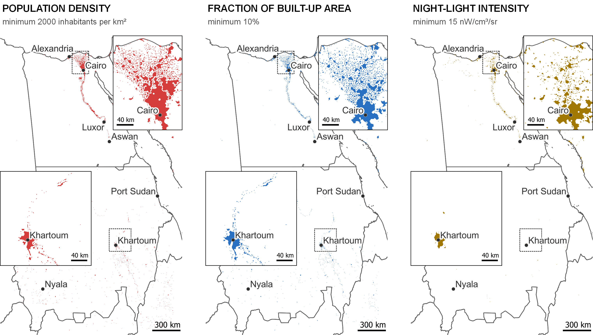

The three most commonly used datasets used to construct urban delineations are arguable population, built-up area and night-time light data. This vignette illustrates how these three proxies can be used to identify urban areas using a combination of the data in the [`flexurbaData`](https://flexurbadata-ac82f4.pages.gitlab.kuleuven.be/index.html) package and the functions in the `flexurba` package.

## Proxy datasets to capture urban areas

Urban delineation approaches typically rely on one or more datasets that serve as proxies for specific characteristics of urbanisation. For instance, the *Degree of Urbanisation* defines boundaries based on a population grid (Dijkstra et al., 2021), the *Atlas of Urban Expansion* delineates urban areas using the presence of the built environment (Angel et al., 2011), and the *Global Rural Urban Mapping Project* relies on night-time light emissions (Balk et al., 2006).

Each of these approaches reflects different assumptions about what makes a place 'urban' (Van Migerode et al., 2024). For instance, population-derived boundaries provide a socio-demographic perspective (Fox & Wolf, 2024). Population data indicate where people reside, serving as a proxy for human activities through their presence at night (Leyk et al., 2019). Meanwhile, built-up areas capture the physical manifestation of urbanisation and are primarily used in planning and environmental applications (Schneider et al., 2009). Night-time light intensity is assumed to capture labour markets, characterised by commercial and economic activities and transportation networks (Dingel et al., 2021).

## The `flexurbaData` package

The `flexurbaData` package includes multiple proxy datasets that could be used in combination with the `flexurba` functions to identify urban areas. The package includes:

-   **Population estimates:** `processed-ghs-pop.tif`

    The layer contains processed population density data derived from the [GHS-POP layer](https://jeodpp.jrc.ec.europa.eu/ftp/jrc-opendata/GHSL/GHS_POP_GLOBE_R2023A/GHS_POP_E2020_GLOBE_R2023A_54009_1000/V1-0/GHS_POP_E2020_GLOBE_R2023A_54009_1000_V1_0.zip) provided by the Joint Research Centre in the context of the [Global Human Settlement Layer](https://human-settlement.emergency.copernicus.eu/).

-   **The fraction of built-up area:** `processed-ghs-built-s.tif`

    The grid contains processed built-up area data derived from the [GHS-BUILT-S layer](https://jeodpp.jrc.ec.europa.eu/ftp/jrc-opendata/GHSL/GHS_BUILT_S_GLOBE_R2023A/GHS_BUILT_S_E2020_GLOBE_R2023A_54009_1000/V1-0/GHS_BUILT_S_E2020_GLOBE_R2023A_54009_1000_V1_0.zip), which is also associated with the [Global Human Settlement Layer](https://human-settlement.emergency.copernicus.eu/).

-   **Night-time light intensity:** `processed-viirs-light.tif`

    The layer contains processed night-time light data derived from the [VIIRS Masked average Layer](https://eogdata.mines.edu/nighttime_light/annual/v21/2020/VNL_v21_npp_2020_global_vcmslcfg_c202205302300.average_masked.dat.tif.gz) provided by the [Earth Observation Group](https://eogdata.mines.edu/products/vnl/).

## Example of urban delineations

The code below demonstrates how to access these data layers and employ them to identify urban areas for Egypt and Sudan. First, make sure to install the `flexurbaData` R package:

```{r, eval=FALSE}
install.packages("remotes")
remotes::install_gitlab("spatial-networks-lab/research-projects/celine/flexurbaData",
                        host="https://gitlab.kuleuven.be/")
```

Afterward, load the necessary libraries and extract the countries Egypt and Sudan from the `ne_country_borders` data (also provided in the `flexurbaData` package):

```{r, eval=FALSE}
library(flexurba)
library(flexurbaData)
library(dplyr)
library(terra)

# extract country borders of Egypt and Sudan
egypt_sudan <- ne_country_borders %>%
  filter(ISO %in% c('EGY', 'SDZ'))
```

The population, built-up area and night-time light data can consequently be retrieved as follows:

```{r, eval=FALSE}
# get population data
pop <- rast(system.file("proxies/processed-ghs-pop.tif", 
                               package = "flexurbaData"))

built <- rast(system.file("proxies/processed-ghs-built-s.tif", 
                               package = "flexurbaData"))

light <- rast(system.file("proxies/processed-viirs-light.tif", 
                               package = "flexurbaData"))
```

To save computing time, we will crop the global data layers to the extent of Egypt and Sudan.

```{r, eval=FALSE}
# crop the data layers
pop <-  crop(pop, ext(egypt_sudan))
built <-  crop(built, ext(egypt_sudan))
light <-  crop(light, ext(egypt_sudan))
```

The function `apply_threshold()` is used to identify urban areas. As illustration, we construct urban areas with a minimum population density threshold of 2000 inhabitants per km², a minimum built-up threshold of 10% and a minimum of 15 nW/cm³/sr, respectively. For more information about different thresholding approaches, see `vignette("vig8-apply-thresholds")`.

```{r, eval=FALSE}
# minimum 2000 inhab/km²
pop_urban_areas <- apply_threshold(grid = pop, 
                                   type = "predefined",
                                   threshold_value = 2000)

# minimum 10%
built_urban_areas <- apply_threshold(grid = built, 
                                   type = "predefined",
                                   threshold_value = 0.10)

# minimum 15 nW/cm³/sr
light_urban_areas <- apply_threshold(grid = light, 
                                   type = "predefined",
                                   threshold_value = 15)
```

The outputs contain three different variables: (1) `rboundaries` with a gridded version of the urban areas, (2) `vboundaries` with the urban areas saved as vector layer, (3) `threshold` with more details on the utilised threshold value. The data of these variables can be used for further analyses.

Below, we display the gridded version of the urban areas (in `rboundaries`). The Nile Delta in Egypt comprises several small scattered urban areas when employing population density or the fraction of built-up area, while urban areas are more concentrated in the night-time light map. Urban areas in Sudan are relatively scarce in Sudan using night-time light; only the city of Khartoum is identified.

{alt="Urban delineation with population, built-up area and night-time light data." width="624"}

## Combination of proxy datasets

Apart from using individual proxies, it is also possible to combine the different datasets to identify urban areas. This can be useful when there are known limitations with a proxy in the study area. As an example, we can identify urban areas as those cells that have at least 2000 inhabitants per km² **or** at least 10% built-up area as follows (note the `|`-operator):

```{r, eval=FALSE}
popORbuilt <- pop_urban_areas$rboundaries | built_urban_areas$rboundaries
```

Similarly, we detect urban areas as having at least 2000 inhabitants per km² **and** 10% built-up area with the `&`-operator.

```{r, eval=FALSE}
popANDbuilt <- pop_urban_areas$rboundaries & built_urban_areas$rboundaries
```

The resulting urban delineations are displayed below. In Sudan, taking the union of the population and built-up area delineation (on the left) or the intersection (on the right) doesn't make much of a difference. However, the urban boundaries in Egypt, and more specifically around Cairo, differ quite significantly.

{alt="Urban delineation with population OR/AND built-up area data." width="416"}

## Concluding remarks

It is important to emphasize that the suitability of a specific proxy dataset depends on the target application of the urban boundaries and the research question at hand. We believe the choice of proxy should ultimately be purpose-driven, ensuring that the dataset aligns with the relevant conceptualisation of the city. The most commonly used proxy datasets are provided in the `flexurbaData` package, enabling fellow researchers to explore the different possibilities in an accessible manner.

## References

Angel, S., Parent, J., Civco, D., & Blei, A. (2011). Making Room for a Planet of Cities. <https://www.lincolninst.edu/publications/policy-focus-reports/making-room-planet-cities>

Balk, D., Deichmann, U., Yetman, G., Pozzi, F., Hay, S. I., & Nelson, A. (2006). Determining Global Population Distribution: Methods, Applications and Data. Advances in Parasitology, 62, 119–156. [https://doi.org/10.1016/S0065-308X(05)62004-0](https://doi.org/10.1016/S0065-308X(05)62004-0){.uri}

Dijkstra, L., Florczyk, A. J., Freire, S., Kemper, T., Melchiorri, M., Pesaresi, M., & Schiavina, M. (2021). Applying the Degree of Urbanisation to the globe: A new harmonised definition reveals a different picture of global urbanisation. Journal of Urban Economics, 125, 103312. <https://doi.org/10.1016/j.jue.2020.103312>

Dingel, J. I., Miscio, A., & Davis, D. R. (2021). Cities, lights, and skills in developing economies. Journal of Urban Economics, 125, 103174. <https://doi.org/10.1016/j.jue.2019.05.005>

Fox, S., & Wolf, L. J. (2024). People make places urban. Nature Cities, 1–8. <https://doi.org/10.1038/s44284-024-00150-5>

Leyk, S., Gaughan, A. E., Adamo, S. B., de Sherbinin, A., Balk, D., Freire, S., Rose, A., Stevens, F. R., Blankespoor, B., Frye, C., Comenetz, J., Sorichetta, A., MacManus, K., Pistolesi, L., Levy, M., Tatem, A. J., & Pesaresi, M. (2019). The spatial allocation of population: A review of large-scale gridded population data products and their fitness for use. Earth System Science Data, 11(3), 1385–1409. <https://doi.org/10.5194/essd-11-1385-2019>

Schneider, A., Friedl, M. A., & Potere, D. (2009). A new map of global urban extent from MODIS satellite data. Environmental Research Letters, 4(4), 044003. <https://doi.org/10.1088/1748-9326/4/4/044003>

Van Migerode, C., Poorthuis, A., & Derudder, B. (2024). A spatially-explicit sensitivity analysis of urban definitions: Uncovering implicit assumptions in the Degree of Urbanisation. Computers, Environment and Urban Systems, 112, 102149. <https://doi.org/10.1016/j.compenvurbsys.2024.102149>
